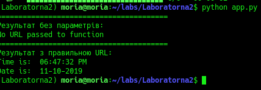
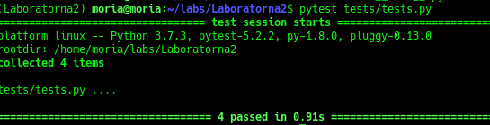
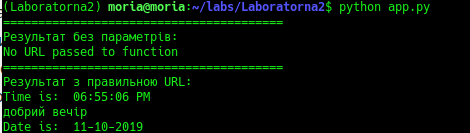

# LAb2

1. Створила папку та readme файл.
2. встановила pipenv та створила середовище
3. встановила бібліотеку requests,ntiplib
4. скопіювала app.py та запустила:

5. встановила бібліотеку pytest та протестувала додаток:

6. написала функцію для перевірки часу та тести. переправила вивід програми та тестів у файл "pytest tests/tests.py > results.txt" та "python app.py >> results.txt". Заповнила makefile

