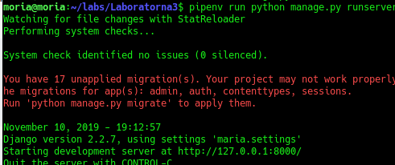
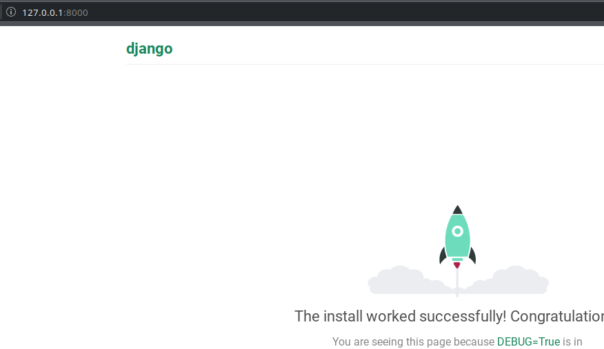

# Lab3

1. ініціалізувала середовище pipenv та встановила бібліотеку django
2. створила заготовку, назва "maria" та винесла файли на рівень вище
3. запустила сервер:

4. створила коміт з базовим темплейтом
