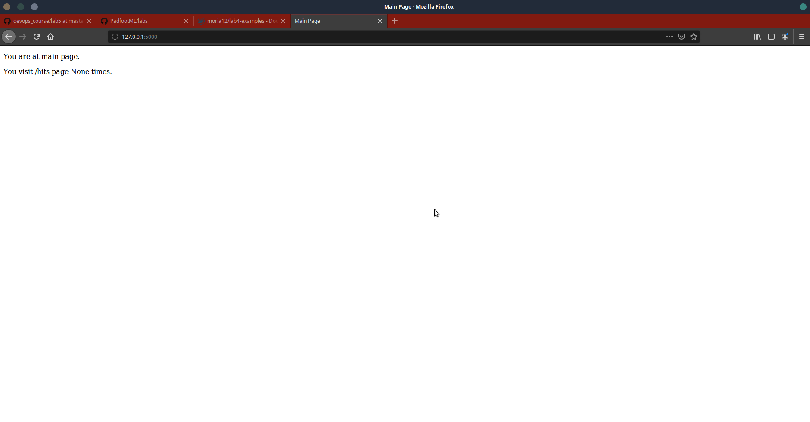
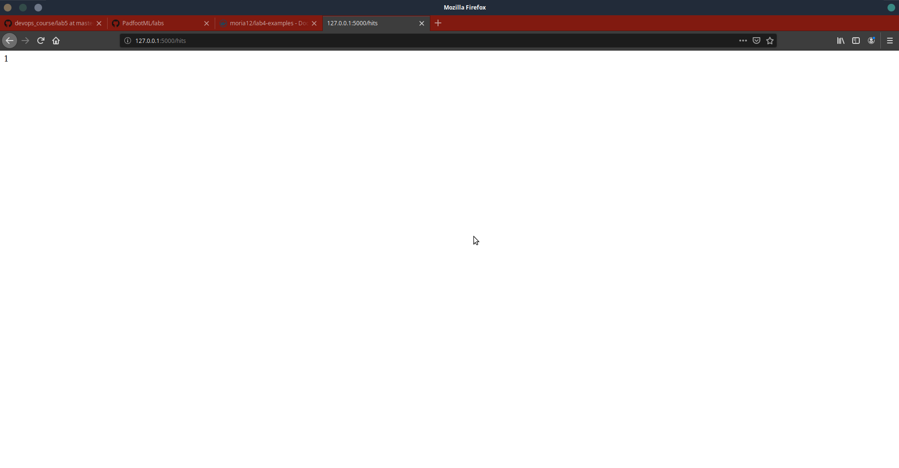
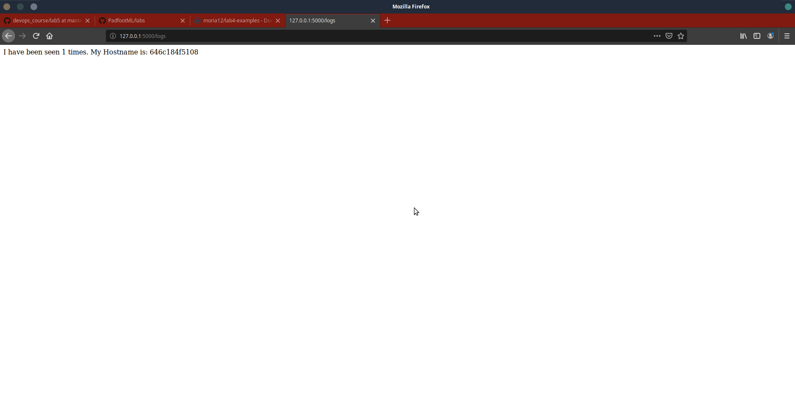

1. Makefile
2. Створила папки та скопіювала файли
3. файл requrements містить залежності, а саме flask, redis nf куйгуіеі
4. Сервер запускається і працює. Доступний через браузер. Тести не проходить та в браузері відображає помилку. Причина в тому що треба встановити redis програму та запустити. Також програма скаржиться на відсутність папки logs.
5. Після тестування почистила не потрібні файли
6. Ознайомилась з файлом makefile:
* STATES - створює змінну зі значеннями які потім можуть динамічно вибиратись
* REPO - змінна містить назву репозиторію
* ціль 'run' - робить запуск необхідних контейнерів та створення мережі.
* test-app - запускає тести
* docker-prune - зупиняє контейнери та очищує ресурси

7. Створила імеджі, запустила контейнери, та очистила ресурси через команди makefile: make app, make tests, make run, make test-app, make docker-prune

* 
* 
* 

8. створила директиву для очистки імеджів та для коміту імеджів : make remove-images та make docker-commit
9. запустила проект через docker-compose. Потрібно зайти на 127.0.0.1:80

10. На мою думку краще використовувати docker-compose - зручніше та націлено на роботу з контейнерами. В деяких випадках раціональніше використовувати makefile. Залежно від ситуації.
11. Створила docker-compose для 4лаби і розмістила його в папці з 4 лабою
12. Всі імеджі закомітила на докерхаб: https://hub.docker.com/r/moria12/lab4-examples/tags